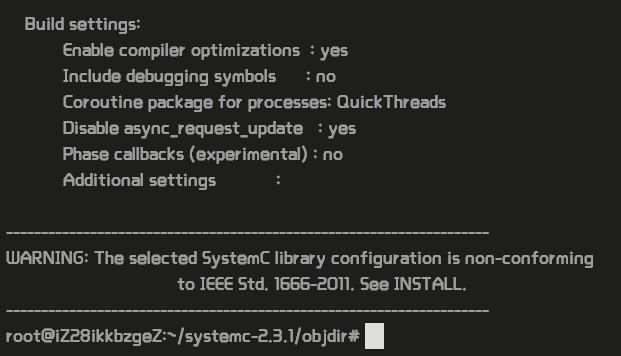

# 如何在ubuntu上装DOL

----------

## Description:
The distributed operation layer (DOL) is a software development framework
to program parallel applications. The DOL allows to specify applications based
on the Kahn process network model of computation and features a simulation
engine based on SystemC. Moreover, the DOL provides an XML-based
specification format to describe the implementation of a parallel application
on a multi-processor systems, including binding and mapping.

详情请参考：[http://www.tik.ee.ethz.ch/~shapes/dol.html](http://www.tik.ee.ethz.ch/~shapes/dol.html)

----------
## 安装一些必要的环境(ubuntu为例)：
<pre>$ sudo apt-get update
$ sudo apt-get install ant
$ sudo apt-get install openjdk-7-jdk
$ sudo apt-get install unzip
</pre>

----------

## 安装过程：
1.下载文件(使用Vmware虚拟机
<pre> sudo wget http://www.accellera.org/images/downloads/standards/systemc/systemc-2.3.1.tgz
sudo wget http://www.tik.ee.ethz.ch/~shapes/downloads/dol_ethz.zip
 </pre>
2.解压文件：
新建dol的文件夹
<pre>$ sudo mkdir do </pre>
将dolethz.zip解压到 dol文件夹中
<pre>$ sudo unzip dol_ethz.zip -d dol </pre>
解压systemc
<pre>$ sudo tar -zxvf systemc-2.3.1.tgz</pre>

3.编译systemc
解压后进入systemc-2.3.1的目录下
<pre>$ cd systemc-2.3.1</pre>
新建一个临时文件夹objder
<pre>$ cd objdir</pre>
运行configure(能根据系统的环境设置一下参数，用于编译)
<pre>$ sudo ../configure CXX=g++ --disable-async-updates</pre>

下图为运行configure之后的截图：

编译：
<pre>$    sudo make install</pre>
编译完后文件目录如下(
<pre>$ cd ..        $ ls</pre>

记录当前的工作路径(会输出当前所在路径，记下来，待会有用)
<pre>$	pwd</pre>

这里表示我当前的工作路径为 /root/systemc-2.3.1

3.编译dol

进入刚刚dol的文件夹
<pre>$	cd ../dol</pre>

修改build_zip.xml文件
找到下面这段话，就是说上面编译的systemc位置在哪里，
property name="systemc.inc" value="YYY/include"
property name="systemc.lib" value="YYY/lib-linux/libsystemc.a"
把YYY改成上页pwd的结果（注意，对于  64位 系统的机器，lib-linux要改成lib-linux64）

然后是编译：
<pre>$	ant -f build_zip.xml all</pre>
若成功显示则显示build successful
接着可以试试运行第一个例子
进入build/bin/mian路径下
<pre>$	cd build/bin/main</pre>
然后运行第一个例子
<pre>$	ant -f runexample.xml -Dnumber=1</pre>

成功结果如图所示：

Run example1:
<pre> $ cd build/bin/main
 $ ant -f runexample.xml -Dnumber=1
</pre>

----------

## Experimental experience
实验中用的ubuntu是管师兄提供的ubuntu，在打开ubuntu时有遇到bios设置中VX-T未使能不能进入的错误，然后重启电脑进入bios将VX-T使能就好了。
